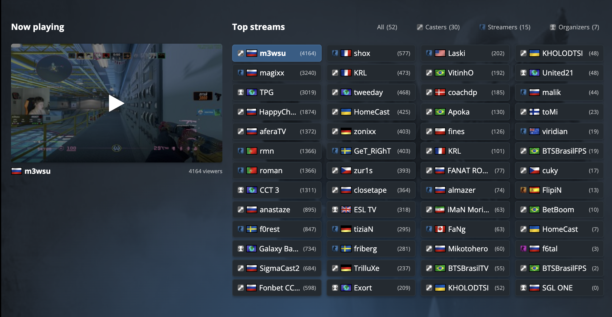

# 🏴‍☠️ HLTV No Russian Flags 🇺🇦

Chrome extension that replaces **Russian flags** on [hltv.org](https://hltv.org) with a **pirate flag**.

---

## ✨ Features

- **Automatic flag swap** – Works on all HLTV pages, including dynamically loaded content.
- **Sprite & `` support** – Handles both CSS sprite flags and regular images.
- **Lightweight** – Pure content script and CSS; no background page or external dependencies.

## 📸 Before & After

**Before:**

**After:**

## ✍🏼 Get in Touch

For any suggestions and collaboration feel free to message me in telegram [@SergeiRuban](https://t.me/sergeiruban)
