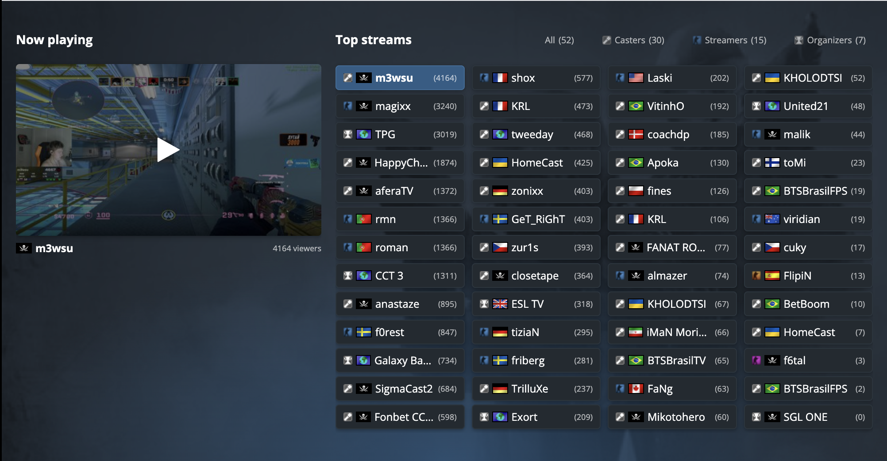

# 🏴‍☠️ HLTV No Russian Flags 🇺🇦

Browser extension that replaces **Russian flags** on [hltv.org](https://hltv.org) with your choice of alternative flags. Compatible with Chrome, Firefox, and other Chromium-based browsers.

---

## ✨ Features

- **Three flag options** – Choose between Pirate Flag, White Flag, or White-Blue-White stripes russian opposition Anti-war Flag
- **User-friendly popup** – Easy flag selection through extension popup interface
- **Automatic flag swap** – Works on all HLTV pages, including dynamically loaded content
- **Sprite & `` support** – Handles both CSS sprite flags and regular images
- **Real-time updates** – Change flags instantly without page refresh
- **Persistent preferences** – Your choice is saved and remembered

## 📸 Before & After

**Before:**

**After:**

## 🚀 How to Use

1. **Install the extension** in Chrome, Firefox, or other compatible browsers
2. **Visit hltv.org** - Russian flags will be automatically replaced with the default white flag
3. **Click the extension icon** in your browser toolbar to open the popup
4. **Choose your preferred flag style**:
   - 🏴‍☠️ **Pirate Flag** - Classic pirate flag (default)
   - ⚪ **White Flag** - Neutral white flag
   - 🔵 **White-Blue-White** - White-Blue-White striped flag
5. **Your choice is saved** and will be applied immediately across all HLTV pages

## ✍🏼 Get in Touch

For any suggestions and collaboration feel free to message me in telegram [@SergeiRuban](https://t.me/sergeiruban)
